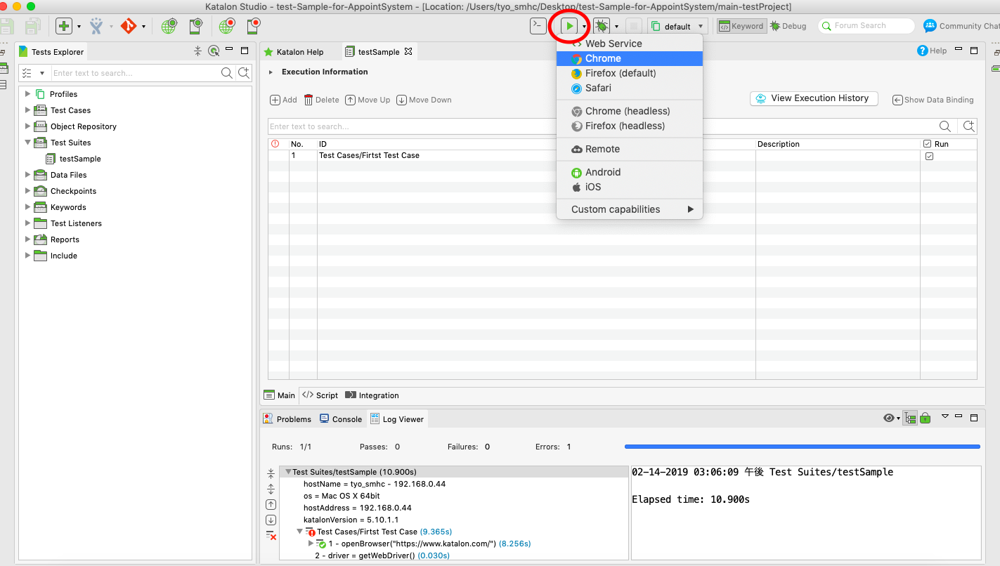
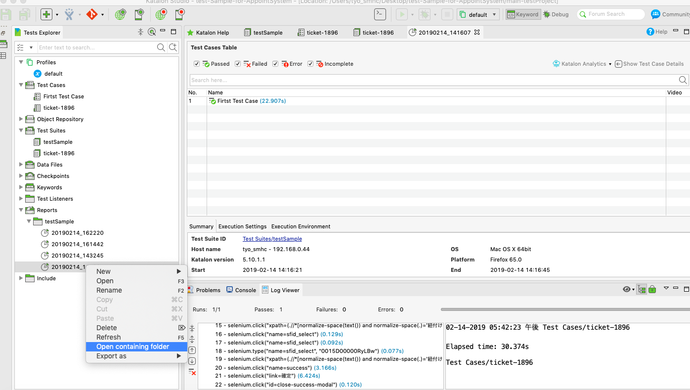

# test-Sample-for-AppointSystem
katalonを利用したテストプロジェクト
## ソースをclone
`git clone https://github.com/joychoSMHC/test-Sample-for-AppointSystem.git`
## katalon studio をインストール
https://www.katalon.com/
## ソースをインポート
メニューから「File」->「Open Project」を選択し、
「test-Sample-for-AppointSystem/main-testProject」を開く

## サンプルテストを実行
[Test Suites]->[testSample」をダブルクリック、テストスイートをRun

## テストレポートの確認

